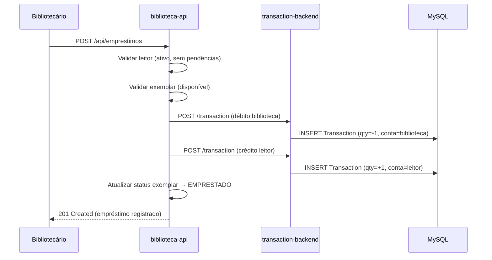
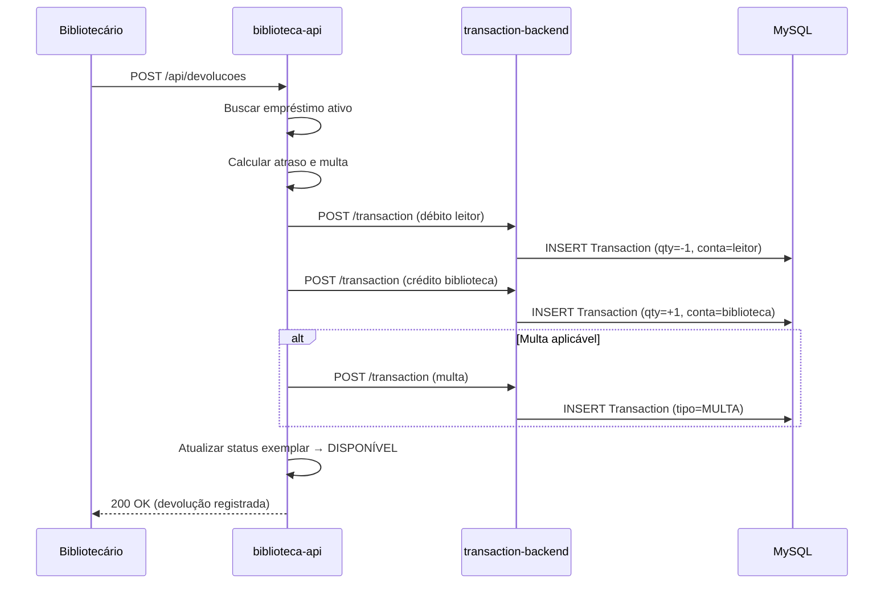

# ITS-HU-06 — Modelo Transacional de Ativos Bibliográficos

Escopo: especificação técnica da HU-06 cobrindo o modelo transacional de dupla entrada para empréstimos, devoluções e vendas digitais.

Relacionado:
- HU: `../HUs/hu-06-modelo-transacional.md`
- HU: `../HUs/hu-07-emprestimo-livros.md`
- HU: `../HUs/hu-08-devolucao-livros.md`
- ITS: `./ITS-HU-01-modelagem-dados-biblioteca.md`

---

## 1. Arquitetura Transacional

### 1.1 Conceito de Dupla Entrada

Toda movimentação de ativo bibliográfico gera **dois lançamentos pareados**:

```
EMPRÉSTIMO:
  Débito  → Conta Biblioteca (exemplar sai)
  Crédito → Conta Leitor (exemplar entra)

DEVOLUÇÃO:
  Débito  → Conta Leitor (exemplar sai)
  Crédito → Conta Biblioteca (exemplar entra)
```

### 1.2 Entidade Transaction (transaction-backend)

```java
Transaction {
    transactionId: String (UUID)      // Identificador único
    federatedIdentifierId: String     // ID do ator (leitor ou biblioteca)
    classId: Integer                  // Tipo da transação (LIB_TIPO_TRANSACAO)
    quantity: Float                   // +1 (crédito) ou -1 (débito)
    docReference: String              // Referência ao exemplar (DublinCoreId)
    transactionDate: LocalDateTime    // Data/hora da transação
}
```

---

## 2. Fluxos Transacionais

### 2.1 Empréstimo de Livro Físico



### 2.2 Devolução de Livro



---

## 3. Scripts SQL - Resolução de IDs

### 3.1 Variáveis para Tipos de Transação

```sql
-- ============================================================================
-- RESOLUÇÃO DE IDs - TIPOS DE TRANSAÇÃO
-- Executar antes de usar as transações
-- ============================================================================

-- Tipos de Transação
SET @id_transacao_emprestimo := (
    SELECT c.ClassId FROM classification_desenvolvimento.Class c 
    JOIN classification_desenvolvimento.ClassScheme cs ON c.ClassSchemeId = cs.ClassSchemeId 
    WHERE cs.Constant = 'LIB_TIPO_TRANSACAO' 
    AND c.Constant = 'TRANSACAO_EMPRESTIMO' LIMIT 1
);

SET @id_transacao_devolucao := (
    SELECT c.ClassId FROM classification_desenvolvimento.Class c 
    JOIN classification_desenvolvimento.ClassScheme cs ON c.ClassSchemeId = cs.ClassSchemeId 
    WHERE cs.Constant = 'LIB_TIPO_TRANSACAO' 
    AND c.Constant = 'TRANSACAO_DEVOLUCAO' LIMIT 1
);

SET @id_transacao_renovacao := (
    SELECT c.ClassId FROM classification_desenvolvimento.Class c 
    JOIN classification_desenvolvimento.ClassScheme cs ON c.ClassSchemeId = cs.ClassSchemeId 
    WHERE cs.Constant = 'LIB_TIPO_TRANSACAO' 
    AND c.Constant = 'TRANSACAO_RENOVACAO' LIMIT 1
);

SET @id_transacao_reserva := (
    SELECT c.ClassId FROM classification_desenvolvimento.Class c 
    JOIN classification_desenvolvimento.ClassScheme cs ON c.ClassSchemeId = cs.ClassSchemeId 
    WHERE cs.Constant = 'LIB_TIPO_TRANSACAO' 
    AND c.Constant = 'TRANSACAO_RESERVA' LIMIT 1
);

SET @id_transacao_venda_digital := (
    SELECT c.ClassId FROM classification_desenvolvimento.Class c 
    JOIN classification_desenvolvimento.ClassScheme cs ON c.ClassSchemeId = cs.ClassSchemeId 
    WHERE cs.Constant = 'LIB_TIPO_TRANSACAO' 
    AND c.Constant = 'TRANSACAO_VENDA_DIGITAL' LIMIT 1
);

SET @id_transacao_multa := (
    SELECT c.ClassId FROM classification_desenvolvimento.Class c 
    JOIN classification_desenvolvimento.ClassScheme cs ON c.ClassSchemeId = cs.ClassSchemeId 
    WHERE cs.Constant = 'LIB_TIPO_TRANSACAO' 
    AND c.Constant = 'TRANSACAO_MULTA' LIMIT 1
);

-- Tipos de Lançamento
SET @id_lancamento_debito := (
    SELECT c.ClassId FROM classification_desenvolvimento.Class c 
    JOIN classification_desenvolvimento.ClassScheme cs ON c.ClassSchemeId = cs.ClassSchemeId 
    WHERE cs.Constant = 'LIB_TIPO_LANCAMENTO' 
    AND c.Constant = 'LANCAMENTO_DEBITO' LIMIT 1
);

SET @id_lancamento_credito := (
    SELECT c.ClassId FROM classification_desenvolvimento.Class c 
    JOIN classification_desenvolvimento.ClassScheme cs ON c.ClassSchemeId = cs.ClassSchemeId 
    WHERE cs.Constant = 'LIB_TIPO_LANCAMENTO' 
    AND c.Constant = 'LANCAMENTO_CREDITO' LIMIT 1
);

-- Tipos de Conta
SET @id_conta_biblioteca := (
    SELECT c.ClassId FROM classification_desenvolvimento.Class c 
    JOIN classification_desenvolvimento.ClassScheme cs ON c.ClassSchemeId = cs.ClassSchemeId 
    WHERE cs.Constant = 'LIB_TIPO_CONTA' 
    AND c.Constant = 'CONTA_BIBLIOTECA' LIMIT 1
);

SET @id_conta_leitor := (
    SELECT c.ClassId FROM classification_desenvolvimento.Class c 
    JOIN classification_desenvolvimento.ClassScheme cs ON c.ClassSchemeId = cs.ClassSchemeId 
    WHERE cs.Constant = 'LIB_TIPO_CONTA' 
    AND c.Constant = 'CONTA_LEITOR' LIMIT 1
);
```

### 3.2 Exemplo de Registro de Empréstimo

```sql
-- ============================================================================
-- EXEMPLO: Registrar empréstimo do exemplar 'EX-001' para leitor 'L-123'
-- ============================================================================

-- Gerar UUID para o par de transações
SET @uuid_emprestimo := UUID();
SET @data_emprestimo := NOW();
SET @exemplar_id := 'dublin-core-id-do-exemplar';
SET @leitor_id := 'federated-identifier-do-leitor';
SET @biblioteca_id := 'federated-identifier-da-biblioteca';

-- 1. Débito na conta da biblioteca (exemplar sai)
INSERT INTO transaction_desenvolvimento.Transaction (
    TransactionId,
    FederatedIdentifierId,
    ClassId,
    Quantity,
    DocReference,
    TransactionDate
) VALUES (
    CONCAT(@uuid_emprestimo, '-DEB'),
    @biblioteca_id,
    @id_transacao_emprestimo,
    -1,  -- Débito
    @exemplar_id,
    @data_emprestimo
);

-- 2. Crédito na conta do leitor (exemplar entra)
INSERT INTO transaction_desenvolvimento.Transaction (
    TransactionId,
    FederatedIdentifierId,
    ClassId,
    Quantity,
    DocReference,
    TransactionDate
) VALUES (
    CONCAT(@uuid_emprestimo, '-CRE'),
    @leitor_id,
    @id_transacao_emprestimo,
    +1,  -- Crédito
    @exemplar_id,
    @data_emprestimo
);

-- 3. Registrar prazo de devolução via TransactionValueDate
INSERT INTO transaction_desenvolvimento.TransactionValueDate (
    TransactionId,
    ClassId,
    DateValue
) VALUES (
    CONCAT(@uuid_emprestimo, '-CRE'),
    @id_config_prazo_emprestimo,  -- ClassId para prazo
    DATE_ADD(@data_emprestimo, INTERVAL 14 DAY)  -- Prazo de 14 dias
);
```

---

## 4. Consultas de Saldo

### 4.1 Saldo de Exemplares da Biblioteca

```sql
-- Total de exemplares disponíveis na biblioteca (tenant)
SELECT 
    SUM(t.Quantity) AS saldo_exemplares
FROM transaction_desenvolvimento.Transaction t
WHERE t.FederatedIdentifierId = @biblioteca_id
AND t.ClassId IN (@id_transacao_emprestimo, @id_transacao_devolucao, @id_transacao_entrada_exemplar, @id_transacao_baixa_exemplar);
```

### 4.2 Exemplares em Posse do Leitor

```sql
-- Exemplares atualmente com o leitor
SELECT 
    t.DocReference AS exemplar_id,
    t.TransactionDate AS data_emprestimo,
    tvd.DateValue AS prazo_devolucao
FROM transaction_desenvolvimento.Transaction t
LEFT JOIN transaction_desenvolvimento.TransactionValueDate tvd ON t.TransactionId = tvd.TransactionId
WHERE t.FederatedIdentifierId = @leitor_id
AND t.Quantity > 0  -- Créditos (exemplares recebidos)
AND t.ClassId = @id_transacao_emprestimo
AND NOT EXISTS (
    -- Excluir se já foi devolvido
    SELECT 1 FROM transaction_desenvolvimento.Transaction t2
    WHERE t2.DocReference = t.DocReference
    AND t2.FederatedIdentifierId = @leitor_id
    AND t2.ClassId = @id_transacao_devolucao
    AND t2.TransactionDate > t.TransactionDate
);
```

### 4.3 Histórico Completo de um Exemplar

```sql
-- Todas as movimentações de um exemplar específico
SELECT 
    t.TransactionId,
    t.TransactionDate,
    cs_tipo.Constant AS tipo_transacao,
    CASE WHEN t.Quantity > 0 THEN 'CRÉDITO' ELSE 'DÉBITO' END AS natureza,
    t.FederatedIdentifierId AS ator
FROM transaction_desenvolvimento.Transaction t
JOIN classification_desenvolvimento.Class c_tipo ON t.ClassId = c_tipo.ClassId
JOIN classification_desenvolvimento.ClassScheme cs_tipo ON c_tipo.ClassSchemeId = cs_tipo.ClassSchemeId
WHERE t.DocReference = @exemplar_id
ORDER BY t.TransactionDate DESC;
```

---

## 5. Integração com Kafka

### 5.1 Eventos Publicados

| Evento | Tópico | Payload |
|--------|--------|---------|
| Empréstimo realizado | `biblioteca.emprestimo.criado` | `{transactionId, leitorId, exemplarId, prazo}` |
| Devolução realizada | `biblioteca.devolucao.criada` | `{transactionId, leitorId, exemplarId, multa}` |
| Multa gerada | `biblioteca.multa.criada` | `{transactionId, leitorId, valor, motivo}` |
| Venda digital | `biblioteca.venda.criada` | `{transactionId, leitorId, tituloId, valor}` |

### 5.2 Consumidores

| Consumidor | Tópico | Ação |
|------------|--------|------|
| NotificacaoService | `biblioteca.emprestimo.criado` | Enviar e-mail de confirmação |
| NotificacaoService | `biblioteca.multa.criada` | Enviar alerta de multa |
| AuditoriaService | `biblioteca.*` | Registrar log em MongoDB |

---

## 6. Endpoints da API

### 6.1 Empréstimos

| Método | Endpoint | Descrição |
|--------|----------|-----------|
| POST | `/api/emprestimos` | Registrar novo empréstimo |
| GET | `/api/emprestimos/{id}` | Buscar empréstimo por ID |
| GET | `/api/emprestimos?leitorId={id}` | Listar empréstimos do leitor |
| GET | `/api/emprestimos/ativos` | Listar empréstimos ativos do tenant |

### 6.2 Devoluções

| Método | Endpoint | Descrição |
|--------|----------|-----------|
| POST | `/api/devolucoes` | Registrar devolução |
| GET | `/api/devolucoes/{id}` | Buscar devolução por ID |

### 6.3 Saldos e Histórico

| Método | Endpoint | Descrição |
|--------|----------|-----------|
| GET | `/api/biblioteca/saldo` | Saldo de exemplares da biblioteca |
| GET | `/api/leitores/{id}/saldo` | Exemplares em posse do leitor |
| GET | `/api/exemplares/{id}/historico` | Histórico de movimentações |
| GET | `/api/leitores/{id}/historico` | Histórico de transações do leitor |

---

## 7. Critérios de Conclusão Técnica (DoD)

- [ ] ClassSchemes e Classes de transação criados (ITS-HU-01)
- [ ] Integração com `transaction-backend` implementada
- [ ] Endpoints de empréstimo funcionando
- [ ] Endpoints de devolução funcionando
- [ ] Cálculo de saldo validado
- [ ] Histórico de exemplar funcionando
- [ ] Eventos Kafka publicados
- [ ] Testes de atomicidade (lote) passando
- [ ] Imutabilidade validada (DELETE bloqueado)

---

## 8. Observações

> **NOTA:** O `transaction-backend` já possui a estrutura de Transaction e TransactionValue*. Esta ITS define apenas os ClassSchemes específicos do domínio biblioteca e os fluxos de negócio.

> **NOTA:** A atomicidade de empréstimos múltiplos deve ser garantida via `@Transactional` no Spring Boot.

> **NOTA:** O histórico de transações é imutável — não há endpoint DELETE para transações.
