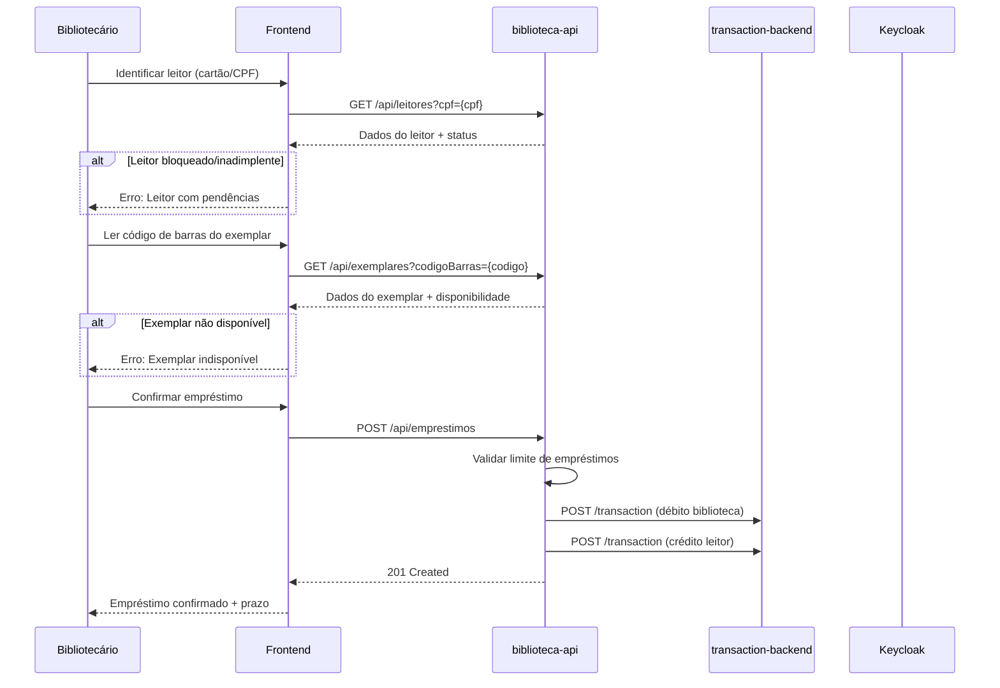

# ITS-HU-07 — Empréstimo de Livros Físicos

Escopo: especificação técnica da HU-07 cobrindo o fluxo completo de empréstimo de livros físicos.

Relacionado:
- HU: `../HUs/hu-07-emprestimo-livros.md`
- HU: `../HUs/hu-08-devolucao-livros.md`
- ITS: `./ITS-HU-06-modelo-transacional.md`

---

## 1. Fluxo de Empréstimo

### 1.1 Diagrama de Sequência



### 1.2 Validações Pré-Empréstimo

| Validação | Condição | Erro |
|-----------|----------|------|
| Leitor ativo | `status != BLOQUEADO, SUSPENSO, INADIMPLENTE` | 403 Forbidden |
| Sem pendências | `multas_pendentes == 0` | 403 Forbidden |
| Limite não atingido | `emprestimos_ativos < limite_tenant` | 400 Bad Request |
| Exemplar disponível | `status == DISPONIVEL` | 409 Conflict |
| Mesmo tenant | `leitor.tenant == exemplar.tenant` | 403 Forbidden |

---

## 2. Scripts SQL

### 2.1 Verificar Elegibilidade do Leitor

```sql
-- Verificar se leitor pode emprestar
SELECT 
    p.PersonId AS leitor_id,
    p.Name AS nome,
    cs_status.Constant AS status,
    (
        SELECT COUNT(*) FROM Transaction t
        WHERE t.FederatedIdentifierId = p.FederatedIdentifierId
        AND t.ClassId = @id_transacao_emprestimo
        AND t.Quantity > 0
        AND NOT EXISTS (
            SELECT 1 FROM Transaction t2
            WHERE t2.DocReference = t.DocReference
            AND t2.ClassId = @id_transacao_devolucao
            AND t2.TransactionDate > t.TransactionDate
        )
    ) AS emprestimos_ativos,
    (
        SELECT COALESCE(SUM(tvf.FloatValue), 0) FROM Transaction t
        JOIN TransactionValueFloat tvf ON t.TransactionId = tvf.TransactionId
        WHERE t.FederatedIdentifierId = p.FederatedIdentifierId
        AND t.ClassId = @id_transacao_multa
        AND NOT EXISTS (
            SELECT 1 FROM Transaction t2
            WHERE t2.DocReference = t.TransactionId
            AND t2.ClassId = @id_transacao_pagamento_multa
        )
    ) AS multas_pendentes
FROM Person p
JOIN PersonValueInteger pvi ON p.PersonId = pvi.PersonId
JOIN Class c_status ON pvi.IntegerValue = c_status.ClassId
JOIN ClassScheme cs_status ON c_status.ClassSchemeId = cs_status.ClassSchemeId
WHERE p.PersonId = @leitor_id
AND cs_status.Constant = 'LIB_STATUS_LEITOR';
```

### 2.2 Registrar Empréstimo

```sql
-- ============================================================================
-- REGISTRAR EMPRÉSTIMO
-- ============================================================================

SET @uuid_emprestimo := UUID();
SET @data_emprestimo := NOW();
SET @prazo_dias := (
    SELECT ouvi.IntegerValue FROM OrganizationUnitValueInteger ouvi
    WHERE ouvi.OrganizationUnitId = @tenant_id
    AND ouvi.ClassId = @id_config_prazo_emprestimo
);

-- 1. Débito na biblioteca (exemplar sai do acervo)
INSERT INTO Transaction (
    TransactionId,
    FederatedIdentifierId,
    ClassId,
    Quantity,
    DocReference,
    TransactionDate
) VALUES (
    CONCAT(@uuid_emprestimo, '-DEB'),
    @biblioteca_federated_id,
    @id_transacao_emprestimo,
    -1,
    @exemplar_id,
    @data_emprestimo
);

-- 2. Crédito no leitor (exemplar entra na posse)
INSERT INTO Transaction (
    TransactionId,
    FederatedIdentifierId,
    ClassId,
    Quantity,
    DocReference,
    TransactionDate
) VALUES (
    CONCAT(@uuid_emprestimo, '-CRE'),
    @leitor_federated_id,
    @id_transacao_emprestimo,
    +1,
    @exemplar_id,
    @data_emprestimo
);

-- 3. Registrar prazo de devolução
INSERT INTO TransactionValueDate (
    TransactionId,
    ClassId,
    DateValue
) VALUES (
    CONCAT(@uuid_emprestimo, '-CRE'),
    @id_config_prazo_emprestimo,
    DATE_ADD(@data_emprestimo, INTERVAL @prazo_dias DAY)
);

-- 4. Registrar bibliotecário responsável
INSERT INTO TransactionValueString (
    TransactionId,
    ClassId,
    StringValue
) VALUES (
    CONCAT(@uuid_emprestimo, '-CRE'),
    @id_rel_emprestimo_bibliotecario,
    @bibliotecario_id
);
```

---

## 3. Endpoints da API

### 3.1 Empréstimos

| Método | Endpoint | Descrição |
|--------|----------|-----------|
| POST | `/api/emprestimos` | Registrar empréstimo |
| POST | `/api/emprestimos/lote` | Empréstimo múltiplo (atômico) |
| GET | `/api/emprestimos/{id}` | Buscar empréstimo |
| GET | `/api/emprestimos/ativos` | Listar empréstimos ativos do tenant |
| GET | `/api/emprestimos/atrasados` | Listar empréstimos atrasados |

### 3.2 Request/Response

**POST /api/emprestimos**

Request:
```json
{
  "leitorId": "uuid-do-leitor",
  "exemplarId": "uuid-do-exemplar",
  "observacoes": "Empréstimo especial autorizado"
}
```

Response (201 Created):
```json
{
  "emprestimoId": "uuid-do-emprestimo",
  "leitor": {
    "id": "uuid-do-leitor",
    "nome": "João Silva"
  },
  "exemplar": {
    "id": "uuid-do-exemplar",
    "codigo": "EX-2024-001",
    "titulo": "Dom Casmurro"
  },
  "dataEmprestimo": "2024-03-21T14:30:00",
  "dataPrevistaDevolucao": "2024-04-04T23:59:59",
  "bibliotecario": "Maria Santos"
}
```

**POST /api/emprestimos/lote**

Request:
```json
{
  "leitorId": "uuid-do-leitor",
  "exemplares": [
    "uuid-exemplar-1",
    "uuid-exemplar-2",
    "uuid-exemplar-3"
  ]
}
```

Response (201 Created):
```json
{
  "emprestimos": [
    { "emprestimoId": "uuid-1", "exemplarCodigo": "EX-001" },
    { "emprestimoId": "uuid-2", "exemplarCodigo": "EX-002" },
    { "emprestimoId": "uuid-3", "exemplarCodigo": "EX-003" }
  ],
  "total": 3,
  "dataPrevistaDevolucao": "2024-04-04T23:59:59"
}
```

---

## 4. Implementação Java

### 4.1 EmprestimoService

```java
@Service
@Transactional
public class EmprestimoService {

    @Autowired
    private TransactionClient transactionClient;
    
    @Autowired
    private LeitorService leitorService;
    
    @Autowired
    private ExemplarService exemplarService;
    
    @Autowired
    private TenantConfigService configService;

    public EmprestimoResponse registrarEmprestimo(EmprestimoRequest request) {
        // 1. Validar leitor
        Leitor leitor = leitorService.buscarPorId(request.getLeitorId());
        validarElegibilidadeLeitor(leitor);
        
        // 2. Validar exemplar
        Exemplar exemplar = exemplarService.buscarPorId(request.getExemplarId());
        validarDisponibilidadeExemplar(exemplar);
        
        // 3. Validar mesmo tenant
        if (!leitor.getTenantId().equals(exemplar.getTenantId())) {
            throw new TenantMismatchException("Leitor e exemplar de tenants diferentes");
        }
        
        // 4. Buscar configurações do tenant
        TenantConfig config = configService.buscarConfig(leitor.getTenantId());
        
        // 5. Validar limite de empréstimos
        int emprestimosAtivos = contarEmprestimosAtivos(leitor.getId());
        if (emprestimosAtivos >= config.getLimiteEmprestimos()) {
            throw new LimiteEmprestimosException("Limite de empréstimos atingido");
        }
        
        // 6. Registrar transações
        String emprestimoId = UUID.randomUUID().toString();
        LocalDateTime agora = LocalDateTime.now();
        LocalDateTime prazo = agora.plusDays(config.getPrazoEmprestimo());
        
        // Débito biblioteca
        transactionClient.registrar(TransactionDTO.builder()
            .transactionId(emprestimoId + "-DEB")
            .federatedIdentifierId(config.getBibliotecaFederatedId())
            .classId(ClassIds.TRANSACAO_EMPRESTIMO)
            .quantity(-1f)
            .docReference(exemplar.getId())
            .transactionDate(agora)
            .build());
        
        // Crédito leitor
        transactionClient.registrar(TransactionDTO.builder()
            .transactionId(emprestimoId + "-CRE")
            .federatedIdentifierId(leitor.getFederatedIdentifierId())
            .classId(ClassIds.TRANSACAO_EMPRESTIMO)
            .quantity(+1f)
            .docReference(exemplar.getId())
            .transactionDate(agora)
            .build());
        
        // 7. Publicar evento Kafka
        kafkaTemplate.send("biblioteca.emprestimo.criado", 
            new EmprestimoCriadoEvent(emprestimoId, leitor.getId(), exemplar.getId(), prazo));
        
        return EmprestimoResponse.builder()
            .emprestimoId(emprestimoId)
            .leitor(leitor.toResumo())
            .exemplar(exemplar.toResumo())
            .dataEmprestimo(agora)
            .dataPrevistaDevolucao(prazo)
            .build();
    }
    
    @Transactional
    public List<EmprestimoResponse> registrarEmprestimoLote(EmprestimoLoteRequest request) {
        // Empréstimo múltiplo é atômico - tudo ou nada
        List<EmprestimoResponse> resultados = new ArrayList<>();
        
        for (String exemplarId : request.getExemplares()) {
            EmprestimoRequest req = new EmprestimoRequest(request.getLeitorId(), exemplarId);
            resultados.add(registrarEmprestimo(req));
        }
        
        return resultados;
    }
}
```

---

## 5. Critérios de Conclusão Técnica (DoD)

- [ ] Endpoint POST /api/emprestimos funcionando
- [ ] Endpoint POST /api/emprestimos/lote funcionando (atômico)
- [ ] Validação de elegibilidade do leitor
- [ ] Validação de disponibilidade do exemplar
- [ ] Validação de limite de empréstimos
- [ ] Transações de dupla entrada registradas
- [ ] Prazo de devolução calculado corretamente
- [ ] Evento Kafka publicado
- [ ] Testes de atomicidade passando

---

## 6. Observações

> **NOTA:** O empréstimo em lote é atômico via `@Transactional`. Se um exemplar falhar, todos são revertidos.

> **NOTA:** O prazo de devolução é calculado com base na configuração do tenant (`CONFIG_PRAZO_EMPRESTIMO`).

> **NOTA:** O status do exemplar é derivado das transações, não atualizado diretamente.
